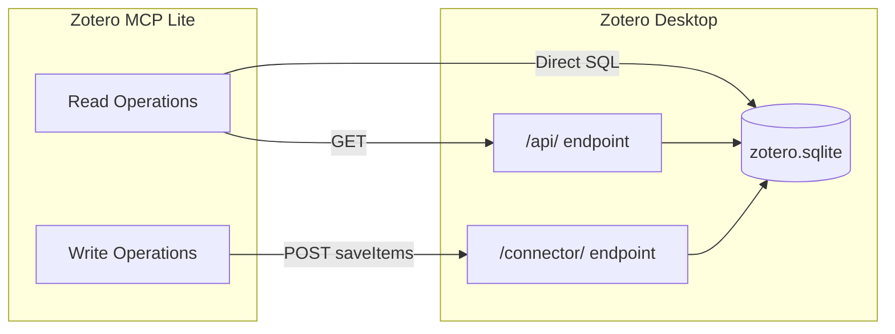
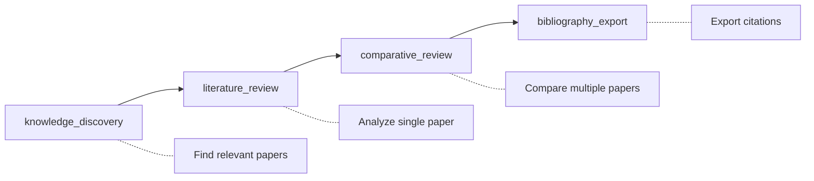
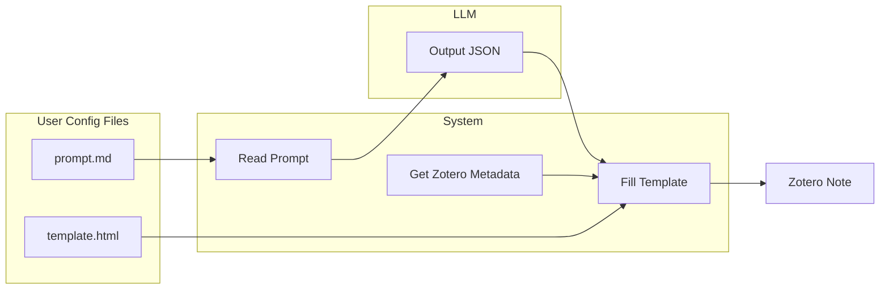

# Zotero MCP Lite

A high-performance Model Context Protocol (MCP) server for Zotero with customizable research workflows.

- **Full Local** - No cloud, no API key; runs entirely via Zotero Desktop
- **Atomic Tools** - 11 composable tools; LLM orchestrates as needed
- **MCP-Native** - Works with Claude, Cursor, Gemini CLI, and any MCP client
- **Extensible** - User-editable prompts and HTML templates
- **Easy Deploy** - Single command install, auto-detects Zotero
- **Parameterized** - Customize analysis sections to match your research style

## Architecture



| Operation | Endpoint | Method |
|-----------|----------|--------|
| Search, browse, read metadata | `/api/users/0/items` | GET |
| Read annotations | Direct SQLite query | SQL |
| Create notes/items | `/connector/saveItems` | POST |

## Quick Start

### Prerequisites

1. **Python 3.10+** with [uv](https://docs.astral.sh/uv/) installed
2. **Zotero 6 or 7** installed

### Step 0: Enable Zotero Local API

The Local API allows third-party applications to communicate with Zotero. **This is required.**

**Steps:**

1. Open **Zotero** → **Edit** → **Settings** (or **Preferences** on macOS)
2. Go to **Advanced** tab
3. Under **Miscellaneous**, check **"Allow other applications on this computer to communicate with Zotero"**

```
┌─────────────────────────────────────────────────────────────┐
│ Advanced                                                    │
├─────────────────────────────────────────────────────────────┤
│                                                             │
│ Miscellaneous                                               │
│                                                             │
│ [V] Automatically check for updated translators and styles  │
│                                                             │
│ [V] Report broken site translators                          │
│                                                             │
│ [V] Allow other applications on this computer to            │
│     communicate with Zotero                   <- Check this │
│                                                             │
│     Available at http://localhost:23119/api/                │
│                                                             │
└─────────────────────────────────────────────────────────────┘
```

Once enabled, the API will be available at `http://localhost:23119/api/`

> **Note:** This is different from the Zotero Connector (browser extension) which is enabled by default. The Local API requires explicit opt-in for security reasons.

### Step 1: Install

```bash
uv tool install "git+https://github.com/xmruuu/zotero-mcp-lite.git"
```

<details>
<summary>Alternative: From source or direct run</summary>

```bash
# From source (for development)
git clone https://github.com/xmruuu/zotero-mcp-lite.git
cd zotero-mcp-lite && uv sync
uv run zotero-mcp setup

# Direct run (no install)
uvx --from "git+https://github.com/xmruuu/zotero-mcp-lite.git" zotero-mcp serve
```
</details>

### Step 2: Setup

```bash
zotero-mcp setup
```

This detects your Zotero installation and configures MCP clients automatically.

### Step 3: Connect to MCP Client

| Client | Configuration |
|--------|---------------|
| **Claude Code** | `claude mcp add zotero -- zotero-mcp serve` |
| **Claude Desktop** | Auto-configured by setup, or edit `claude_desktop_config.json` |
| **Cursor** | Settings → MCP Servers → add `{"zotero": {"command": "zotero-mcp", "args": ["serve"]}}` |
| **Other** | Use command `zotero-mcp` with args `["serve"]` (stdio transport) |

That's it! You're ready to use Zotero with AI assistants.

## Design Principles

- **Atomic tools**: Each tool does one thing well. LLM composes them as needed.
- **Template engine**: LLM outputs structured JSON; system handles HTML formatting for consistent, professional notes.
- **Customizable workflows**: Prompts and templates are user-editable files, not hardcoded logic.
- **Direct SQLite access**: Millisecond-level annotation queries without API overhead.
- **Minimal dependencies**: Only essential packages for maximum compatibility.

## Features

### 11 Atomic MCP Tools

**Search and Navigation**

- `zotero_search_items` - Keyword search with tag filtering
- `zotero_get_recent` - Recently modified/added items (excludes notes by default)
- `zotero_get_collections` - List all collections
- `zotero_get_collection_items` - Items in a collection (excludes notes by default)
- `zotero_get_tags` - All tags in library
- `zotero_search_annotations` - Search all PDF highlights across library

**Content Reading**

- `zotero_get_item_metadata` - Metadata, authors, abstract, tags
- `zotero_get_item_children` - Attachments, notes, and PDF annotations
- `zotero_get_item_fulltext` - Full text extraction

**Writing** (via local Connector API)

- `zotero_create_note` - Create new note (standalone or attached)
- `zotero_create_review` - Create formatted review note with auto-filled metadata

### 4 Research Prompts

Pre-defined workflows that guide AI through common academic tasks:



| Prompt | Use Case | What It Does |
|--------|----------|--------------|
| `knowledge_discovery(query)` | Explore a topic | Searches titles AND your annotations |
| `literature_review(item_key)` | Deep-dive one paper | Structured analysis with/without annotations |
| `comparative_review(item_keys)` | Compare papers | Cross-paper synthesis, gaps, consensus |
| `bibliography_export(item_keys)` | Prepare citations | BibTeX + formatted references |

**Key Features:**

- **Dual-mode analysis**: Works with or without user annotations
- **Template-based output**: LLM outputs JSON, system handles HTML formatting
- **Fully customizable**: Edit prompt and template files to match your workflow
- See [Customizing Prompts](#customizing-prompts) for details

## Advanced

### Testing & Debugging

```bash
npx @modelcontextprotocol/inspector zotero-mcp serve
```

Opens a web UI to test tools interactively.

### Alternative Transports

```bash
zotero-mcp serve --transport streamable-http --port 8000
zotero-mcp serve --transport sse --port 8000
```

### Environment Variables

```bash
# Custom Zotero data directory
export ZOTERO_DATA_DIR=/path/to/Zotero

# Group libraries
export ZOTERO_LIBRARY_ID=12345
export ZOTERO_LIBRARY_TYPE=group
```

## Technical Notes

### Annotation Retrieval

Annotations are fetched directly from Zotero's SQLite database using a three-level join:

```
Item -> PDF Attachment -> Annotation
```

This approach is significantly faster than the Web API and works offline.

### Cross-Platform Support

Automatically detects Zotero data directory on Windows, macOS, and Linux.

## Troubleshooting

| Problem | Solution |
|---------|----------|
| "Local API is not enabled" | Enable in Zotero → Settings → Advanced (see [Step 0](#step-0-enable-zotero-local-api)) |
| "Database is locked" | Normal when Zotero is running; API tools still work |
| General diagnostics | Run `zotero-mcp setup` |

## Customizing Prompts

The prompts and HTML templates are fully customizable. After running `zotero-mcp setup`, you'll find configuration files at:

```
~/.zotero-mcp/prompts/
├── literature_review.md           # Prompt instructions
├── literature_review_template.html # HTML note template
├── comparative_review.md
└── comparative_review_template.html
```

#### How Template Engine Works



**Benefits:**
- LLM only outputs analysis content as JSON (saves tokens, faster response)
- System handles all HTML formatting (consistent, error-free output)
- Metadata auto-filled from Zotero (title, authors, year, etc.)

#### Prompt Files (`.md`)

Define how the AI should analyze papers and what JSON fields to output:

```markdown
## Analysis Instructions

Analyze the paper and output JSON with these fields:
- objective: Main research question
- methods: Methodology used
- contribution: Key contributions
- gaps: Limitations identified

## Example Output

zotero_create_review(
    item_key="ABC123",
    analysis={
        "objective": "This paper investigates...",
        "methods": "Using a survey of 500 participants...",
        "contribution": "The key finding is...",
        "gaps": "Limitations include..."
    }
)
```

#### Template Files (`.html`)

Define how notes appear in Zotero. Use `${variable}` placeholders:

**Metadata (auto-filled from Zotero):**

| Variable | Description |
|----------|-------------|
| `${title}` | Paper title |
| `${authors}` | Formatted author names |
| `${year}` | Publication year |
| `${publicationTitle}` | Journal/venue name |
| `${DOI}` | Digital Object Identifier |
| `${abstractNote}` | Paper abstract |
| `${tags}` | Comma-separated tags |
| `${itemLink}` | Zotero item link |

**Analysis (from LLM JSON output):**

| Variable | Description |
|----------|-------------|
| `${objective}` | Research objective analysis |
| `${methods}` | Methods analysis |
| `${contribution}` | Contribution analysis |
| `${gaps}` | Gaps analysis |
| ... | Any custom field you define |

Simply add `${your_field}` in the template and include `"your_field": "..."` in the JSON output

## Credits

Thanks to [@54yyyu](https://github.com/54yyyu) for the original [zotero-mcp](https://github.com/54yyyu/zotero-mcp) project.

## License

MIT License - See [LICENSE](LICENSE) file.
