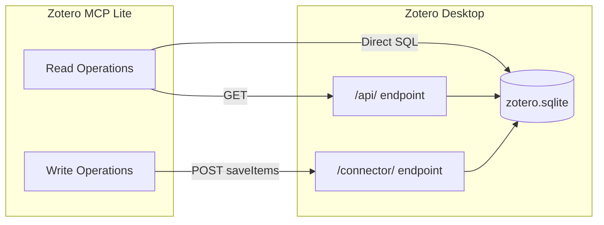
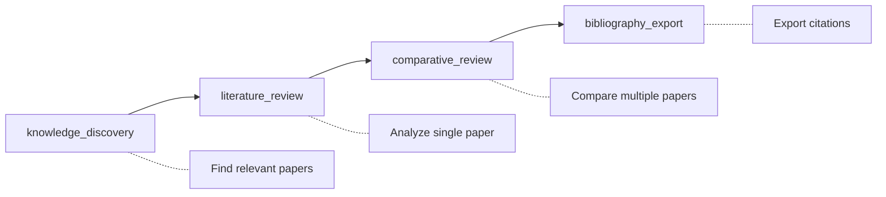

# Zotero MCP Lite

[](https://pypi.org/project/zotero-mcp-lite/)
[](https://www.zotero.org/)
[](https://www.python.org/)
[](https://modelcontextprotocol.io/)
[](LICENSE)
[](https://docs.astral.sh/uv/)

A high-performance Model Context Protocol (MCP) server for Zotero with customizable research workflows.

- **Full Local** - No cloud, no API key; runs entirely via Zotero Desktop
- **Atomic Tools** - 9 composable tools; LLM orchestrates as needed
- **MCP-Native** - Works with Claude, Cursor, Gemini CLI, and any MCP client
- **Extensible** - User-editable prompts for customized workflows
- **Easy Deploy** - Single command install, auto-detects Zotero
- **Parameterized** - Customize analysis sections to match your research style

## Architecture



| Operation | Endpoint | Method |
|-----------|----------|--------|
| Search, browse, read metadata | `/api/users/0/items` | GET |
| Read annotations | Direct SQLite query | SQL |
| Create notes/items | `/connector/saveItems` | POST |

## Quick Start

### Prerequisites

1. **Python 3.10+** with [uv](https://docs.astral.sh/uv/) installed
2. **Zotero 6 or 7** installed

### Step 0: Enable Zotero Local API

The Local API allows third-party applications to communicate with Zotero. **This is required.**

**Steps:**

1. Open **Zotero** → **Edit** → **Settings** (or **Preferences** on macOS)
2. Go to **Advanced** tab
3. Under **Miscellaneous**, check **"Allow other applications on this computer to communicate with Zotero"**

```
┌─────────────────────────────────────────────────────────────┐
│ Advanced                                                    │
├─────────────────────────────────────────────────────────────┤
│                                                             │
│ Miscellaneous                                               │
│                                                             │
│ [V] Automatically check for updated translators and styles  │
│                                                             │
│ [V] Report broken site translators                          │
│                                                             │
│ [V] Allow other applications on this computer to            │
│     communicate with Zotero                   <- Check this │
│                                                             │
│     Available at http://localhost:23119/api/                │
│                                                             │
└─────────────────────────────────────────────────────────────┘
```

Once enabled, the API will be available at `http://localhost:23119/api/`

> **Note:** This is different from the Zotero Connector (browser extension) which is enabled by default. The Local API requires explicit opt-in for security reasons.

### Step 1: Install

```bash
uv tool install zotero-mcp-lite
```

Or with pip:

```bash
pip install zotero-mcp-lite
```

<details>
<summary>Alternative: Install from GitHub or source</summary>

```bash
# From GitHub (latest development version)
uv tool install "git+https://github.com/xmruuu/zotero-mcp-lite.git"

# From source (for development)
git clone https://github.com/xmruuu/zotero-mcp-lite.git
cd zotero-mcp-lite && uv sync
uv run zotero-mcp setup

# Direct run without install
uvx zotero-mcp-lite serve
```
</details>

### Step 2: Setup

```bash
zotero-mcp setup
```

This detects your Zotero installation and configures MCP clients automatically.

### Step 3: Connect to MCP Client

| Client | Configuration |
|--------|---------------|
| **Claude Code** | `claude mcp add zotero -- zotero-mcp serve` |
| **Claude Desktop** | Auto-configured by setup, or edit `claude_desktop_config.json` |
| **Cursor** | Settings → MCP Servers → add `{"zotero": {"command": "zotero-mcp", "args": ["serve"]}}` |
| **Other** | Use command `zotero-mcp` with args `["serve"]` (stdio transport) |

That's it! You're ready to use Zotero with AI assistants.

## Features

### 9 Atomic MCP Tools

**Search and Navigation**

- `zotero_search_items` - Keyword search with tag filtering
- `zotero_get_recent` - Recently modified/added items (excludes notes by default)
- `zotero_get_collections` - List all collections
- `zotero_get_collection_items` - Items in a collection (excludes notes by default)
- `zotero_search_annotations` - Search all PDF highlights across library

**Content Reading**

- `zotero_get_item_metadata` - Metadata, authors, abstract, tags
- `zotero_get_item_children` - Attachments, notes, and PDF annotations
- `zotero_get_item_fulltext` - Full text extraction

**Writing** (via local Connector API)

- `zotero_create_note` - Create note with full formatting support (tables, lists, line breaks)

### 4 Research Skills (MCP Prompts)

Pre-defined workflows that guide AI through common academic tasks:



| Skill | Use Case | What It Does |
|-------|----------|--------------|
| `knowledge_discovery(query)` | Explore a topic | Searches titles AND your annotations |
| `literature_review(item_key)` | Deep-dive one paper | Structured analysis from annotations or full text |
| `comparative_review(item_keys)` | Compare papers | Table-rich synthesis with insights |
| `bibliography_export(item_keys)` | Prepare citations | APA, IEEE, and BibTeX formats |

**Key Features:**

- **Dual-mode analysis**: Works with or without user annotations
- **Full formatting preserved**: Tables, line breaks, and lists write correctly to Zotero
- **Fully customizable**: Edit prompt files to match your workflow
- See [Customizing Skills](#customizing-skills) for details

> **For Claude Desktop Users:** These 4 MCP Prompts automatically become powerful Skills in Claude. Simply ask Claude to help with literature review, paper comparison, or bibliography export - it will invoke the appropriate skill with your Zotero library.

## Advanced

### Testing & Debugging

```bash
npx @modelcontextprotocol/inspector zotero-mcp serve
```

Opens a web UI to test tools interactively.

### Alternative Transports

```bash
zotero-mcp serve --transport streamable-http --port 8000
zotero-mcp serve --transport sse --port 8000
```

### Environment Variables

```bash
# Direct path to Zotero database (most specific)
export ZOTERO_DATABASE_PATH=/path/to/zotero.sqlite

# Or specify Zotero data directory (will find database automatically)
export ZOTERO_DATA_DIR=/path/to/Zotero

# Group libraries
export ZOTERO_LIBRARY_ID=12345
export ZOTERO_LIBRARY_TYPE=group
```

## Technical Notes

### Annotation Retrieval

Annotations are fetched directly from Zotero's SQLite database using a three-level join:

```
Item -> PDF Attachment -> Annotation
```

This approach is significantly faster than the Web API and works offline.

### Cross-Platform Support

Automatically detects Zotero data directory on Windows, macOS, and Linux.

## Troubleshooting

| Problem | Solution |
|---------|----------|
| "Local API is not enabled" | Enable in Zotero → Settings → Advanced (see [Step 0](#step-0-enable-zotero-local-api)) |
| "Database is locked" | Normal when Zotero is running; API tools still work |
| General diagnostics | Run `zotero-mcp setup` |

## Customizing Skills

Prompts are fully customizable. Copy from the package defaults and edit:

```
~/.zotero-mcp/prompts/
├── literature_review.md      # Single paper analysis skill
├── comparative_review.md     # Multi-paper comparison skill
├── knowledge_discovery.md    # Topic exploration skill
└── bibliography_export.md    # Citation export skill
```

**Loading order:** User files (`~/.zotero-mcp/prompts/`) take priority over package defaults.

#### How It Works


The LLM generates the complete review text with your desired formatting (tables, lists, etc.), then saves it directly via `zotero_create_note`. All formatting is preserved.

#### Prompt Files (`.md`)

Define how the AI should analyze papers:

```markdown
## Analysis Instructions

Analyze the paper covering:
- Research Objective
- Methods
- Contribution
- Research Gaps

Use tables and bullet points as appropriate.

## Save to Zotero

Use `zotero_create_note(content=<your review>, parent_key=<item_key>)`
```

You can customize the analysis sections, add new ones, or change the output format entirely

## Credits

Thanks to [@54yyyu](https://github.com/54yyyu) for the original [zotero-mcp](https://github.com/54yyyu/zotero-mcp) project.

## License

MIT License - See [LICENSE](LICENSE) file.
