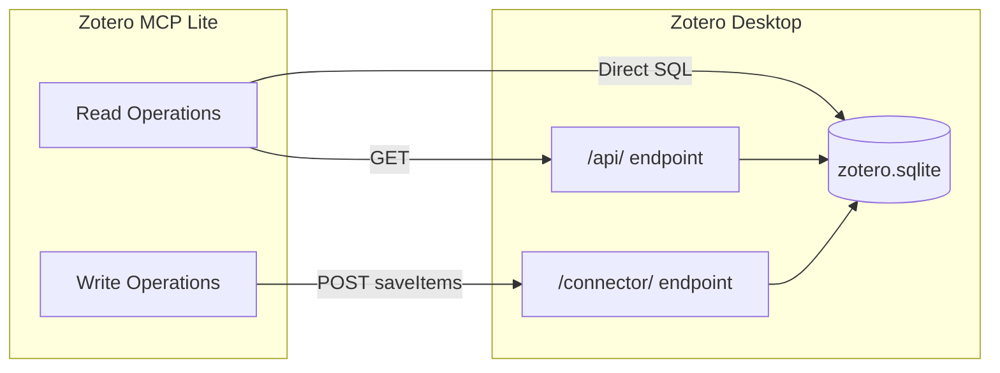

# Zotero MCP Lite

[](https://pypi.org/project/zotero-mcp-lite/)
[](https://www.zotero.org/)
[](https://www.python.org/)
[](https://modelcontextprotocol.io/)
[](LICENSE)
[](https://docs.astral.sh/uv/)

A high-performance Model Context Protocol (MCP) server for Zotero with customizable research workflows.

- **Full Local** - No cloud, no API key; runs entirely via Zotero Desktop
- **Atomic Tools** - 9 composable tools; LLM orchestrates as needed
- **MCP-Native** - Works with any MCP client
- **Extensible** - User-editable prompts to match your research style
- **Easy Deploy** - Single command install, auto-detects Zotero

## Architecture



## Quick Start

### Prerequisites

1. **Python 3.10+** 
2. **Zotero 6 or 7** installed

### Step 0: Enable Zotero Local API

The Local API allows third-party applications to communicate with Zotero. **This is required.**

**Steps:**

1. Open **Zotero** → **Edit** → **Settings** (or **Preferences** on macOS)
2. Go to **Advanced** tab
3. Under **Miscellaneous**, check **"Allow other applications on this computer to communicate with Zotero"**
4. The API will be available at `http://localhost:23119/api/`

> **Note:** The Local API requires manual enabling (unlike the browser Connector).

### Step 1: Install

```bash
uv tool install zotero-mcp-lite
```

Or with pip:

```bash
pip install zotero-mcp-lite
```

<details>
<summary>Alternative: Install from GitHub or source</summary>

```bash
# From GitHub (latest development version)
uv tool install "git+https://github.com/xmruuu/zotero-mcp-lite.git"

# From source (for development)
git clone https://github.com/xmruuu/zotero-mcp-lite.git
cd zotero-mcp-lite && uv sync
uv run zotero-mcp setup

# Direct run without install
uvx zotero-mcp-lite serve
```

</details>

### Step 2: Setup

```bash
zotero-mcp setup
```

This detects your Zotero installation and configures MCP clients automatically.

### Step 3: Connect to MCP Client

**Claude Code** (one command):

```bash
claude mcp add zotero -- zotero-mcp serve
```

**Other MCP clients** — add to your MCP config JSON:

```json
{
  "mcpServers": {
    "zotero": {
      "command": "zotero-mcp",
      "args": ["serve"]
    }
  }
}
```

That's it! You're ready to use Zotero with AI assistants.

## Features

### 9 Atomic MCP Tools

**Search and Navigation**

- `zotero_search_items` - Keyword search with tag filtering
- `zotero_get_recent` - Recently modified/added items (excludes notes by default)
- `zotero_get_collections` - List all collections
- `zotero_get_collection_items` - Items in a collection (excludes notes by default)
- `zotero_search_annotations` - Search all PDF highlights across library

**Content Reading**

- `zotero_get_item_metadata` - Metadata, authors, abstract, tags
- `zotero_get_item_children` - Attachments, notes, and PDF annotations
- `zotero_get_item_fulltext` - Full text extraction

**Writing** (via local Connector API)

- `zotero_create_note` - Create note with full formatting support (tables, lists, line breaks)

### 4 Research Skills (MCP Prompts)

Pre-defined workflows that guide AI through common academic tasks:

| Skill                              | Use Case            | What It Does                                      |
| ---------------------------------- | ------------------- | ------------------------------------------------- |
| `knowledge_discovery(query)`     | Explore a topic     | Searches titles AND your annotations              |
| `literature_review(item_key)`    | Deep-dive one paper | Structured analysis from annotations or full text |
| `comparative_review(item_keys)`  | Compare papers      | Table-rich synthesis with insights                |
| `bibliography_export(item_keys)` | Prepare citations   | APA, IEEE, and BibTeX formats                     |

Works with or without annotations. Fully customizable. See [Customizing Skills](#customizing-skills).

## Debugging

Debugging MCP servers can be challenging. Use MCP Inspector:

```bash
npx @modelcontextprotocol/inspector zotero-mcp serve
```

This opens a web UI to test tools and prompts interactively.

## Technical Notes

- Annotations: Direct SQLite query (faster than Web API, works offline)
- Cross-platform: Auto-detects Zotero on Windows, macOS, Linux
- Architecture: Read via `/api/`, Write via `/connector/`, Annotations via SQLite

## Customizing Skills

Prompts are fully customizable. Copy from the package defaults and edit:

```
~/.zotero-mcp/prompts/
├── literature_review.md      # Single paper analysis skill
├── comparative_review.md     # Multi-paper comparison skill
├── knowledge_discovery.md    # Topic exploration skill
└── bibliography_export.md    # Citation export skill
```

**Loading order:** User files (`~/.zotero-mcp/prompts/`) take priority over package defaults.

Edit the `.md` files to customize analysis sections, add new ones, or change the output format entirely.

## Credits

Thanks to [@54yyyu](https://github.com/54yyyu) for the original [zotero-mcp](https://github.com/54yyyu/zotero-mcp) project.

## License

MIT License - See [LICENSE](LICENSE) file.
